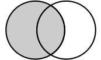
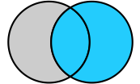
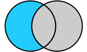
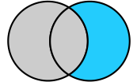
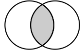
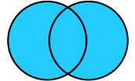

# duomolog
A method to identify the best set of homologous sequences from two homology searching approaches.


# Usage
```
NAME
    duomolog

SYNOPSIS
    duomolog COMMAND | VALUE

COMMANDS
    COMMAND is one of the following:

     blast_v_hmmer

VALUES
    VALUE is one of the following:

     blastOut

     hmmerOut

INFO: Showing help with the command 'duomolog blast_v_hmmer -- --help'.

NAME
    duomolog blast_v_hmmer

SYNOPSIS
    duomolog blast_v_hmmer INFILE QUERYFILE <flags>

POSITIONAL ARGUMENTS
    INFILE
    QUERYFILE

FLAGS
    --summaryOut=SUMMARYOUT
        Default: 'duomolog_out/summary...
    --blastFile=BLASTFILE
        Type: Optional[]
        Default: None
    --alnFile=ALNFILE
        Type: Optional[]
        Default: None
    --hmmFile=HMMFILE
        Type: Optional[]
        Default: None
    --intersectOnly=INTERSECTONLY
        Default: False

NOTES
    You can also use flags syntax for POSITIONAL ARGUMENTS
```
# Sub-commands
`blast_v_hmmer`
- compares hits of BLAST results vs HMMER

`hmm_v_hmm`
- Compares results from HMMER using two different Hidden Markov Models


# Duo comparison

The `Duo` object in `duo.py` takes in two `set()` objects of strings and returns the following comparisons (given a `left` set and a `right` set) with [python set operations](https://docs.python.org/3/library/stdtypes.html#set).
## Left

## Right


# Exclusive
## Left only

`left - right`
## Right only

`right - left`
# Intersection

`left & right`
# Union

`left | right`


# Pick the best subset

<!-- To be conservative, for now I am only focusing on the intersection. In the future, I would like to construct a multiple sequence alignment from the query  hits and the verified input, and compare the alignments and pick the subset that has the "best alignment" (less gappy, ) -->